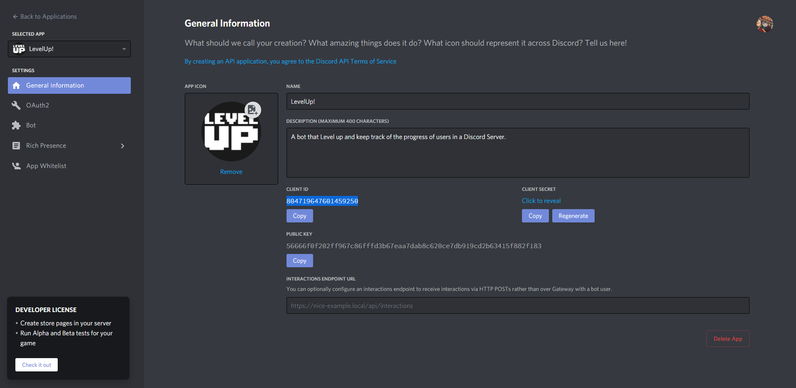
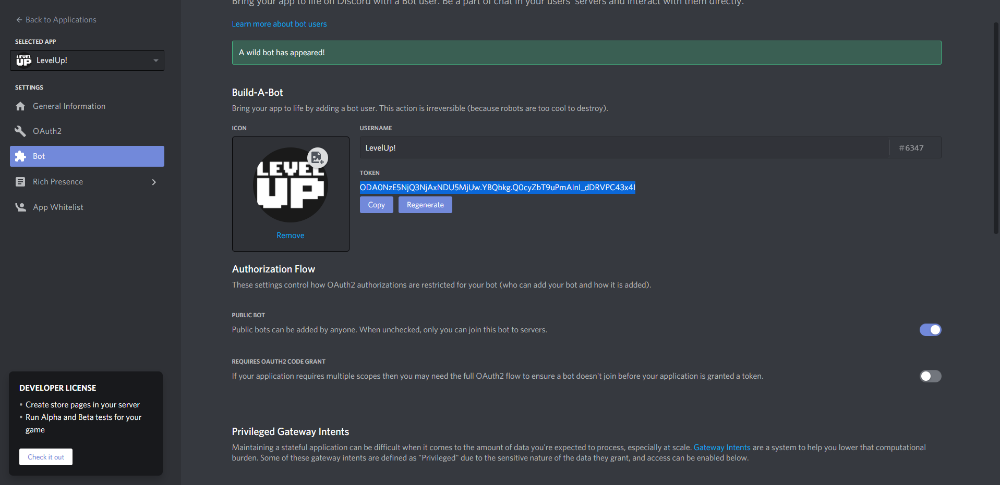
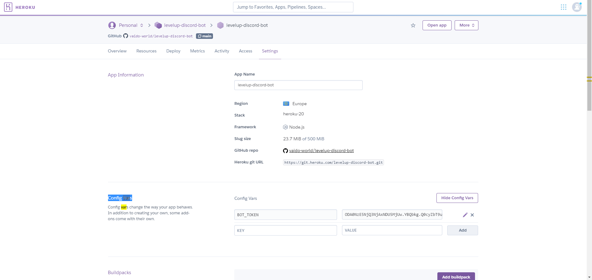

# levelup-discord-bot
It's written in JavaScript, hosted in GitHub and Executed by Heroku.  
https://medium.com/@mason.spr/hosting-a-discord-js-bot-for-free-using-heroku-564c3da2d23f  
 

### Future Notices
The bot is still incomplete and can't save progress. 

Therefore requires a database.  
https://stackoverflow.com/questions/48630490/best-way-to-save-data-using-node-js-with-heroku  

Example, on using mlab database with Heroku: https://www.sitepoint.com/building-facebook-chat-bot-node-heroku/   
**The mLab team has discontinued their MongoDB add-on.** **https://devcenter.heroku.com/articles/mongolab**  
Heroku mlab Discontinued: https://devcenter.heroku.com/changelog-items/1823   
**If you’re considering remaining with mLab/Atlas, you should reference mLab’s documentation.** https://docs.mlab.com/shutdown-of-heroku-add-on/  

### Development Mongodb Database http://cloud.mongodb.com/v2/601574be6333196123975b91#clusters?fastPoll=true
[MongoDB Atlas heroku discord.js bot](https://www.google.com/search?ei=L20VYN37IseurgSC566wBw&q=MongoDB+Atlas+heroku+discord.js+bot&oq=MongoDB+Atlas+heroku+discord.js+bot&gs_lcp=CgZwc3ktYWIQAzoFCCEQoAE6BwghEAoQoAFQ50BYvGtg02xoCHAAeACAAXiIAcIIkgEDNS42mAEAoAEBqgEHZ3dzLXdpesABAQ&sclient=psy-ab&ved=0ahUKEwidz6yK78PuAhVHl4sKHYKzC3YQ4dUDCA0&uact=5)

A Discord bot that can manage roles: https://github.com/bpbuch/discord-role-bot  
A Discord bot that could count messages of a Discord Server memebers and save them in a Database.  

## Invite:
<a href="https://discord.com/oauth2/authorize?client_id=804719647601459250&scope=bot&permissions=0">client_id=804719647601459250</a>

## Control Panel
https://discord.com/developers/applications/804719647601459250/bot

## Usage
Simply writing `ping` in a Discord Server Chat,   
a simple message `pong` should be given as a response.  

## Notices
Remember, the original guide to creating and hosting a bot on Heroku had a mistake.  
`procfile` should be renamed to `Procfile`  

## Notes
`The Variable’s key should be BOT_TOKEN and the
 value should be the Client Secret you copied earlier.`  
Token can be found in https://discord.com/developers/applications/804719647601459250/bot  
This Token has to be added to **Settings** of **Config Vars** in **Heroku**  

